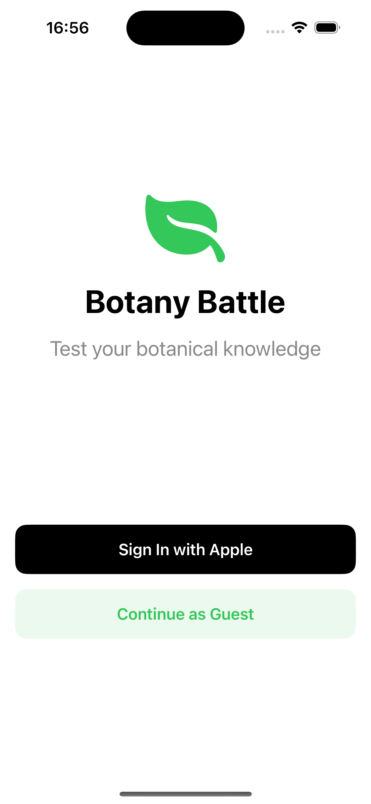
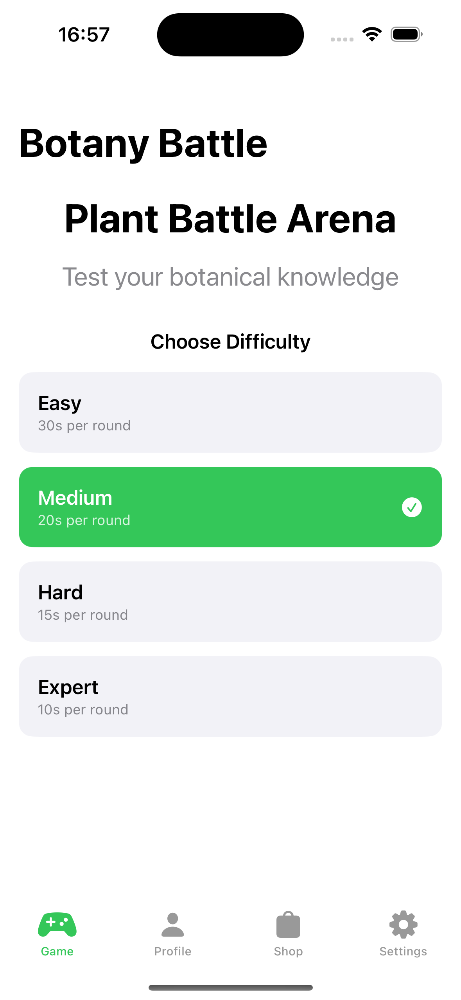
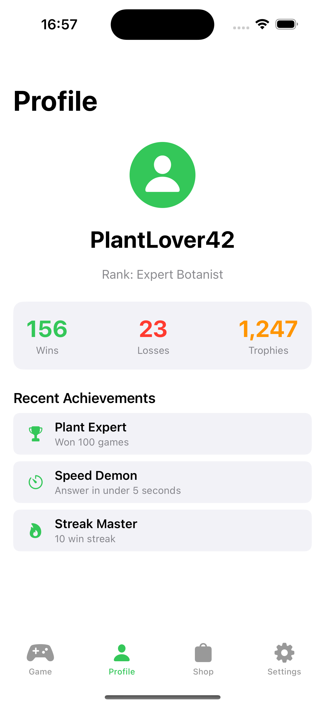

# Botany Battle 🌿

A real-time multiplayer mobile game where players battle to identify plant species. Test your botanical knowledge in head-to-head matches, earn Trophies, and customize your profile with unique items!

## 📱 Screenshots

<div align="center">
  
  
  
</div>

*Welcome screen with authentication options, main game arena with difficulty selection, and user profile with stats and achievements.*

## 🎮 Features

- Real-time multiplayer battles
- Plant identification challenges
- Skill-based matchmaking
- In-game currency (Trophies)
- Cosmetic customization shop
- Educational plant facts
- Social features and friend challenges

## 🛠 Tech Stack

### Backend
- Serverless Framework
- AWS Lambda
- API Gateway
- DynamoDB
- ElastiCache (Redis)
- S3
- Cognito

### Frontend
- iOS Native (Swift)
- SwiftUI
- Combine
- WebSocket

## 🚀 Getting Started

### Prerequisites
- Xcode 15.0+
- Node.js 18.0+
- AWS CLI
- Serverless Framework
- CocoaPods

### Development Setup

1. **Clone the repository**
   ```bash
   git clone https://github.com/your-org/botany-battle.git
   cd botany-battle
   ```

2. **Backend Setup**
   ```bash
   cd backend
   npm install
   cp .env.example .env
   # Configure your .env file with necessary credentials
   serverless deploy --stage dev
   ```

3. **iOS Setup**
   ```bash
   cd ios
   pod install
   open BotanyBattle.xcworkspace
   ```

## 📁 Project Structure

```
botany-battle/
├── backend/
│   ├── src/
│   │   ├── functions/
│   │   │   ├── auth/
│   │   │   ├── game/
│   │   │   ├── plant/
│   │   │   └── shop/
│   │   ├── lib/
│   │   └── utils/
│   ├── tests/
│   └── serverless.yml
├── ios/
│   ├── Sources/
│   │   ├── App/
│   │   ├── Features/
│   │   ├── Core/
│   │   └── Resources/
│   ├── Tests/
│   └── Podfile
└── docs/
    ├── api/
    ├── architecture/
    └── development/
```

## 🧪 Testing

### Backend Tests
```bash
# Unit Tests
cd backend
npm run test:unit

# Integration Tests
npm run test:integration

# Load Tests
npm run test:load
```

### iOS Tests
```bash
# Unit Tests
cd ios
xcodebuild test -scheme BotanyBattle -destination 'platform=iOS Simulator,name=iPhone 15'

# UI Tests
xcodebuild test -scheme BotanyBattleUITests -destination 'platform=iOS Simulator,name=iPhone 15'
```

## 📚 Documentation

- [API Documentation](docs/api/README.md)
- [Architecture Overview](docs/architecture/README.md)
- [Development Guide](docs/development/README.md)
- [Testing Guide](docs/development/testing.md)
- [Deployment Guide](docs/development/deployment.md)

## 🔐 Security

- Cognito for authentication
- JWT for session management
- HTTPS for all communications
- API Gateway rate limiting
- Regular security audits
- GDPR compliance

## 🤝 Contributing

1. Fork the repository
2. Create your feature branch (`git checkout -b feature/AmazingFeature`)
3. Write tests for your feature
4. Implement your feature
5. Ensure all tests pass
6. Submit a pull request

## 📝 Code Standards

### Backend
- ESLint + Prettier
- TypeScript strict mode
- Jest for testing
- Serverless best practices

### iOS
- SwiftLint
- SwiftFormat
- XCTest for testing
- SwiftUI best practices

## 🏗 Architecture

### Backend
- Serverless architecture
- Lambda functions for business logic
- DynamoDB for data storage
- ElastiCache for real-time state
- S3 for static assets
- API Gateway for HTTP/WebSocket

### iOS
- MVVM architecture
- SwiftUI for UI
- Combine for reactive programming
- Swift Concurrency for async operations

## 📊 Monitoring

### Backend
- CloudWatch metrics
- X-Ray tracing
- Custom metrics
- Error tracking

### iOS
- Crash reporting
- Performance monitoring
- User analytics
- Error tracking

## 🔄 CI/CD Pipeline

1. Code push triggers automated tests
2. Successful tests trigger deployment
3. Backend deploys to AWS
4. iOS builds for TestFlight
5. Automated rollback on failure

## 📱 App Store

- iOS App Store Link: [Coming Soon]
- Minimum iOS Version: 15.0
- Device Support: iPhone only

## 📄 License

This project is licensed under the MIT License - see the [LICENSE](LICENSE) file for details.

## 🙏 Acknowledgments

- iNaturalist API for plant data
- All contributors and supporters
- The plant identification community

## 🎯 Project Status

See TODO.md for details.

### Current Phase
- Phase 1: Project Setup
- Next Milestone: Backend Foundation Complete

### Recent Updates
- Initial project setup
- Development environment configuration
- Basic architecture implementation

### Upcoming Features
- Authentication system
- Game logic implementation
- Plant service integration
- Economy system

## 🧪 Quality Metrics

### Code Quality
- Unit test coverage > 80%
- Integration test coverage > 70%
- UI test coverage > 60%
- Zero critical security issues
- All accessibility requirements met

### Performance
- API response time < 200ms
- Matchmaking time < 15 seconds
- App launch time < 2 seconds
- Memory usage < 100MB
- Battery impact < 5% per hour

## 🔍 Development Workflow

1. **Feature Development**
   ```bash
   # Create feature branch
   git checkout -b feature/new-feature
   
   # Run tests
   npm run test
   xcodebuild test
   
   # Submit PR
   git push origin feature/new-feature
   ```

2. **Code Review**
   - All tests must pass
   - Code style requirements met
   - Documentation updated
   - Performance requirements met

3. **Deployment**
   ```bash
   # Deploy backend
   serverless deploy --stage dev
   
   # Deploy iOS
   fastlane beta
   ```

## 🛠 Development Tools

### Required Tools
- Xcode 15.0+
- Node.js 18.0+
- AWS CLI
- Serverless Framework
- CocoaPods
- Fastlane

### Recommended Tools
- Cursor.ai
- Claude Code

---

*Built with ❤️ by Soren🐻 and Gunnar🐰* 