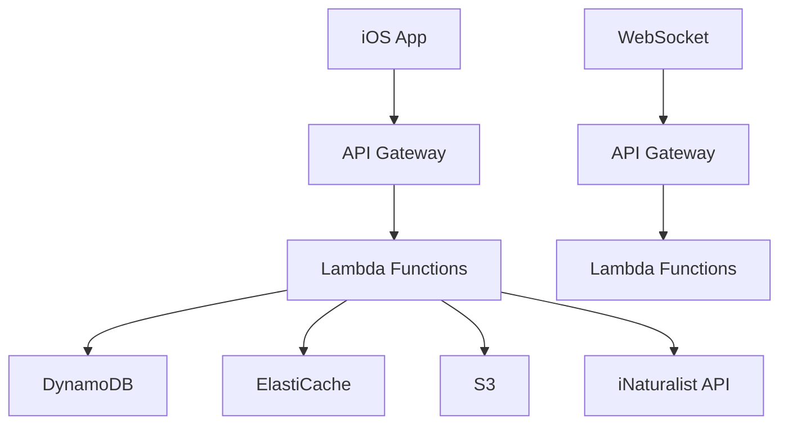

# Botany Battle Backend Design

## TL;DR
- Serverless-first approach
- Managed services everywhere possible
- Minimal operational overhead
- Pay only for what we use

## Architecture Overview



## Core Components

### 1. API Layer
- **AWS API Gateway**
  - REST API for HTTP endpoints
  - WebSocket API for real-time game
  - Built-in rate limiting
  - Automatic scaling
  - Pay per request

### 2. Compute
- **AWS Lambda**
  - Node.js 18.x runtime
  - TypeScript
  - 128MB memory (default)
  - 10s timeout
  - Auto-scaling
  - Pay per 100ms

### 3. Data Storage
- **DynamoDB**
  - Single-table design
  - On-demand capacity
  - Global tables for low latency
  - Pay per request

- **ElastiCache (Redis)**
  - Serverless Redis
  - Session storage
  - Real-time game state
  - Pay per hour

- **S3**
  - Plant images
  - User avatars
  - CDN-backed
  - Pay per GB

### 4. Authentication
- **Cognito**
  - OAuth 2.0
  - Social sign-in
  - JWT tokens
  - Pay per MAU

## Data Models

### DynamoDB Table Design

```typescript
// Single table design
interface TableItem {
  PK: string;  // Partition Key
  SK: string;  // Sort Key
  type: string;
  data: any;
  createdAt: string;
  updatedAt: string;
}

// Key patterns
// User: USER#<userId>
// Game: GAME#<gameId>
// Plant: PLANT#<plantId>
// Shop: SHOP#<itemId>
```

## API Endpoints

### REST API
```typescript
// Auth
POST /auth/login
POST /auth/refresh

// User
GET /user/profile
PUT /user/profile
GET /user/stats

// Game
POST /game/match
GET /game/<id>
POST /game/<id>/answer

// Shop
GET /shop/items
POST /shop/purchase
```

### WebSocket API
```typescript
// Game Events
interface GameEvent {
  type: 'GAME_START' | 'ROUND_START' | 'ANSWER_SUBMITTED' | 'ROUND_END' | 'GAME_END';
  data: any;
}
```

## Lambda Functions

### 1. Game Management
```typescript
// game-manager.ts
export const handler = async (event: APIGatewayEvent) => {
  // Game creation, state management, scoring
};
```

### 2. Matchmaking
```typescript
// matchmaker.ts
export const handler = async (event: APIGatewayEvent) => {
  // Player matching, skill-based matchmaking
};
```

### 3. Plant Service
```typescript
// plant-service.ts
export const handler = async (event: APIGatewayEvent) => {
  // iNaturalist API integration, plant data management
};
```

### 4. Economy Service
```typescript
// economy-service.ts
export const handler = async (event: APIGatewayEvent) => {
  // Currency management, shop transactions
};
```

## Real-time Game Flow

1. **Game Start**
   - Create game record in DynamoDB
   - Initialize Redis game state
   - Notify players via WebSocket

2. **Round Start**
   - Select plant from iNaturalist API
   - Generate answer options
   - Send to players via WebSocket

3. **Answer Submission**
   - Validate answer
   - Update game state
   - Calculate round winner
   - Notify players

4. **Game End**
   - Calculate final scores
   - Update player stats
   - Award currency
   - Clean up game state

## Error Handling

```typescript
// Global error handler
const errorHandler = (error: Error) => {
  if (error instanceof ValidationError) {
    return { statusCode: 400, body: error.message };
  }
  if (error instanceof AuthError) {
    return { statusCode: 401, body: error.message };
  }
  return { statusCode: 500, body: 'Internal Server Error' };
};
```

## Monitoring

- **CloudWatch**
  - Lambda metrics
  - API Gateway metrics
  - DynamoDB metrics
  - Custom metrics

- **X-Ray**
  - Request tracing
  - Performance analysis
  - Error tracking

## Security

- **API Gateway**
  - API key validation
  - Rate limiting
  - CORS configuration

- **Lambda**
  - IAM roles
  - VPC configuration
  - Environment variables

- **DynamoDB**
  - IAM policies
  - Encryption at rest
  - Point-in-time recovery

## Deployment

```yaml
# serverless.yml
service: botany-battle

provider:
  name: aws
  runtime: nodejs18.x
  region: us-east-1
  stage: ${opt:stage, 'dev'}

functions:
  gameManager:
    handler: src/game-manager.handler
    events:
      - http:
          path: /game
          method: post
      - websocket:
          route: $connect
```

## Cost Optimization

- **Lambda**
  - Right-size memory
  - Optimize cold starts
  - Use provisioned concurrency

- **DynamoDB**
  - On-demand capacity
  - TTL for temporary data
  - Efficient key design

- **API Gateway**
  - Cache responses
  - Compress responses
  - Use WebSocket for real-time

## Development Workflow

1. **Local Development**
   ```bash
   npm install -g serverless
   serverless offline
   ```

2. **Testing**
   ```bash
   npm test
   serverless invoke local
   ```

3. **Deployment**
   ```bash
   serverless deploy --stage dev
   ```

## Future Considerations

- **Scaling**
  - Global tables for low latency
  - Multi-region deployment
  - Edge caching

- **Features**
  - Analytics pipeline
  - A/B testing
  - Feature flags

- **Cost**
  - Reserved capacity
  - Savings plans
  - Cost allocation tags

## Gotchas & Solutions

1. **Cold Starts**
   - Use provisioned concurrency
   - Keep functions warm
   - Optimize package size

2. **WebSocket Limits**
   - Implement reconnection
   - Handle connection drops
   - Monitor connection count

3. **DynamoDB Throttling**
   - Use on-demand capacity
   - Implement backoff
   - Monitor consumed capacity

## Quick Start

```bash
# Clone repo
git clone https://github.com/your-org/botany-battle.git

# Install dependencies
npm install

# Deploy to dev
serverless deploy --stage dev

# Test locally
serverless offline
```

## Resources

- [AWS Serverless Documentation](https://aws.amazon.com/serverless/)
- [DynamoDB Best Practices](https://docs.aws.amazon.com/amazondynamodb/latest/developerguide/best-practices.html)
- [Lambda Power Tools](https://awslabs.github.io/aws-lambda-powertools-typescript/)
- [Serverless Framework](https://www.serverless.com/framework/docs) 