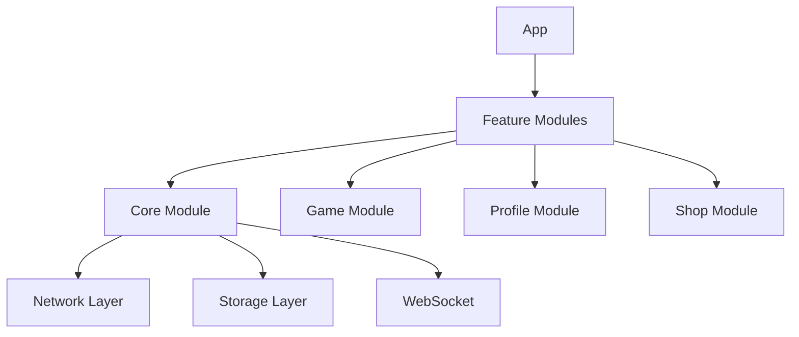

# Botany Battle iOS Design

## TL;DR
- SwiftUI + Combine
- MVVM + Coordinator
- Modular architecture
- Swift Concurrency
- TCA for complex features

## Architecture Overview



## Core Architecture

### 1. App Structure
```swift
@main
struct BotanyBattleApp: App {
    @StateObject private var appCoordinator = AppCoordinator()
    
    var body: some Scene {
        WindowGroup {
            appCoordinator.rootView
        }
    }
}
```

### 2. Module Organization
```
BotanyBattle/
├── App/
│   ├── AppCoordinator.swift
│   ├── AppDelegate.swift
│   └── SceneDelegate.swift
├── Features/
│   ├── Game/
│   ├── Profile/
│   ├── Shop/
│   └── Auth/
├── Core/
│   ├── Network/
│   ├── Storage/
│   ├── WebSocket/
│   └── Extensions/
└── Resources/
    ├── Assets.xcassets
    ├── Localizable.strings
    └── Info.plist
```

## Feature Modules

### 1. Game Module
```swift
// GameView.swift
struct GameView: View {
    @StateObject private var viewModel: GameViewModel
    @EnvironmentObject private var coordinator: GameCoordinator
    
    var body: some View {
        // Game UI
    }
}

// GameViewModel.swift
@MainActor
final class GameViewModel: ObservableObject {
    @Published private(set) var gameState: GameState
    @Published private(set) var roundState: RoundState
    
    private let gameService: GameService
    private let websocketClient: WebSocketClient
    
    // Game logic
}
```

### 2. Profile Module
```swift
// ProfileView.swift
struct ProfileView: View {
    @StateObject private var viewModel: ProfileViewModel
    
    var body: some View {
        // Profile UI
    }
}

// ProfileViewModel.swift
@MainActor
final class ProfileViewModel: ObservableObject {
    @Published private(set) var userProfile: UserProfile
    @Published private(set) var stats: UserStats
    
    private let profileService: ProfileService
    
    // Profile logic
}
```

## Core Components

### 1. Network Layer
```swift
// NetworkClient.swift
actor NetworkClient {
    private let session: URLSession
    private let decoder: JSONDecoder
    
    func request<T: Decodable>(_ endpoint: Endpoint) async throws -> T {
        // Network request implementation
    }
}

// Endpoint.swift
enum Endpoint {
    case login
    case profile
    case game(id: String)
    case shop
    
    var path: String {
        // Endpoint paths
    }
}
```

### 2. WebSocket Client
```swift
// WebSocketClient.swift
actor WebSocketClient {
    private var webSocket: URLSessionWebSocketTask?
    private let session: URLSession
    
    func connect() async throws {
        // WebSocket connection
    }
    
    func send(_ message: GameMessage) async throws {
        // Send message
    }
    
    func receive() async throws -> GameMessage {
        // Receive message
    }
}
```

### 3. Storage Layer
```swift
// StorageManager.swift
actor StorageManager {
    private let userDefaults: UserDefaults
    private let fileManager: FileManager
    
    func save<T: Encodable>(_ object: T, forKey key: String) async throws {
        // Save implementation
    }
    
    func load<T: Decodable>(forKey key: String) async throws -> T {
        // Load implementation
    }
}
```

## UI Components

### 1. Design System
```swift
// Theme.swift
enum Theme {
    static let primary = Color("Primary")
    static let secondary = Color("Secondary")
    static let background = Color("Background")
    
    static let spacing = Spacing()
    static let typography = Typography()
}

// Components.swift
struct PrimaryButton: View {
    let title: String
    let action: () -> Void
    
    var body: some View {
        Button(action: action) {
            Text(title)
                .font(.headline)
                .foregroundColor(.white)
                .frame(maxWidth: .infinity)
                .padding()
                .background(Theme.primary)
                .cornerRadius(10)
        }
    }
}
```

### 2. Game UI
```swift
// PlantCard.swift
struct PlantCard: View {
    let plant: Plant
    let onSelect: (String) -> Void
    
    var body: some View {
        // Plant card UI
    }
}

// AnswerOptions.swift
struct AnswerOptions: View {
    let options: [String]
    let onSelect: (String) -> Void
    
    var body: some View {
        // Answer options UI
    }
}
```

## State Management

### 1. App State
```swift
// AppState.swift
@MainActor
final class AppState: ObservableObject {
    @Published var isAuthenticated = false
    @Published var currentUser: User?
    @Published var currentGame: Game?
    
    private let authService: AuthService
    private let gameService: GameService
    
    // State management
}
```

### 2. Game State
```swift
// GameState.swift
struct GameState: Equatable {
    var status: GameStatus
    var currentRound: Int
    var playerScore: Int
    var opponentScore: Int
    var timeRemaining: TimeInterval
}

enum GameStatus: Equatable {
    case waiting
    case playing
    case finished
}
```

## Dependencies

### 1. Package.swift
```swift
// swift-tools-version:5.5
import PackageDescription

let package = Package(
    name: "BotanyBattle",
    platforms: [.iOS(.v15)],
    products: [
        .library(name: "BotanyBattle", targets: ["BotanyBattle"])
    ],
    dependencies: [
        .package(url: "https://github.com/pointfreeco/swift-composable-architecture", from: "0.9.0"),
        .package(url: "https://github.com/onevcat/Kingfisher", from: "7.0.0")
    ],
    targets: [
        .target(
            name: "BotanyBattle",
            dependencies: [
                .product(name: "ComposableArchitecture", package: "swift-composable-architecture"),
                "Kingfisher"
            ]
        )
    ]
)
```

## Testing Strategy

### 1. Unit Tests
```swift
// GameViewModelTests.swift
final class GameViewModelTests: XCTestCase {
    var sut: GameViewModel!
    var mockGameService: MockGameService!
    
    override func setUp() {
        super.setUp()
        mockGameService = MockGameService()
        sut = GameViewModel(gameService: mockGameService)
    }
    
    func testGameStart() async throws {
        // Test implementation
    }
}
```

### 2. UI Tests
```swift
// GameUITests.swift
final class GameUITests: XCTestCase {
    var app: XCUIApplication!
    
    override func setUp() {
        super.setUp()
        app = XCUIApplication()
        app.launch()
    }
    
    func testGameFlow() {
        // UI test implementation
    }
}
```

## Performance Considerations

### 1. Image Loading
```swift
// ImageLoader.swift
struct ImageLoader: View {
    let url: URL
    
    var body: some View {
        KFImage(url)
            .placeholder {
                ProgressView()
            }
            .fade(duration: 0.3)
            .cacheMemoryOnly()
    }
}
```

### 2. Memory Management
```swift
// MemoryManager.swift
final class MemoryManager {
    static let shared = MemoryManager()
    
    func clearImageCache() {
        ImageCache.default.clearMemoryCache()
    }
    
    func clearDiskCache() {
        ImageCache.default.clearDiskCache()
    }
}
```

## Security

### 1. Keychain Storage
```swift
// KeychainManager.swift
actor KeychainManager {
    func save(_ data: Data, forKey key: String) throws {
        // Keychain save implementation
    }
    
    func load(forKey key: String) throws -> Data {
        // Keychain load implementation
    }
}
```

### 2. Certificate Pinning
```swift
// CertificatePinningDelegate.swift
class CertificatePinningDelegate: NSObject, URLSessionDelegate {
    func urlSession(
        _ session: URLSession,
        didReceive challenge: URLAuthenticationChallenge,
        completionHandler: @escaping (URLSession.AuthChallengeDisposition, URLCredential?) -> Void
    ) {
        // Certificate pinning implementation
    }
}
```

## Analytics

### 1. Analytics Service
```swift
// AnalyticsService.swift
protocol AnalyticsService {
    func trackEvent(_ event: AnalyticsEvent)
    func trackScreen(_ screen: AnalyticsScreen)
}

// AnalyticsEvent.swift
enum AnalyticsEvent {
    case gameStart
    case gameEnd(score: Int)
    case purchase(item: String)
}
```

## Localization

### 1. Localization Manager
```swift
// LocalizationManager.swift
enum LocalizationManager {
    static func localizedString(_ key: String) -> String {
        NSLocalizedString(key, comment: "")
    }
}

// Localizable.strings
/*
"game.start" = "Start Game";
"game.end" = "Game Over";
"shop.purchase" = "Purchase";
*/
```

## Development Workflow

### 1. Git Flow
```bash
# Feature branch
git checkout -b feature/game-implementation

# Development
git add .
git commit -m "feat: implement game mechanics"

# Pull request
git push origin feature/game-implementation
```

### 2. CI/CD
```yaml
# .github/workflows/ci.yml
name: CI

on:
  push:
    branches: [ main ]
  pull_request:
    branches: [ main ]

jobs:
  build:
    runs-on: macos-latest
    steps:
      - uses: actions/checkout@v2
      - name: Build
        run: xcodebuild test -scheme BotanyBattle
```

## Resources

- [SwiftUI Documentation](https://developer.apple.com/documentation/swiftui)
- [Combine Documentation](https://developer.apple.com/documentation/combine)
- [The Composable Architecture](https://github.com/pointfreeco/swift-composable-architecture)
- [Swift Concurrency](https://docs.swift.org/swift-book/LanguageGuide/Concurrency.html) 